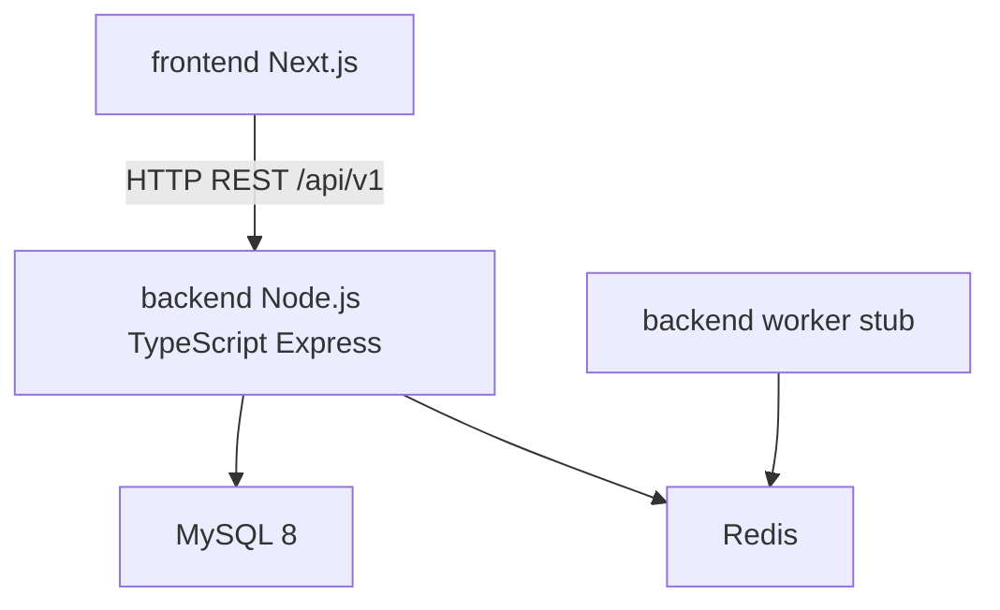

# Architecture

Phase 1 is a modular monolith. The web portal and future AI channels call the same Node.js + TypeScript REST APIs. The API is the source of truth. Nothing outside the API writes to MySQL.

The web app never imports backend source or database code. The API never imports React or Next.js.

## Layering

Routes → application services → Drizzle → MySQL

Route handlers stay thin. Tenant id is taken from the JWT, never from the request body.

## Phase 1 modules

auth, business-types, tenants, businesses, locations, users, roles, permissions, health

Bookings, customers, records, payments, and AI are not implemented.
