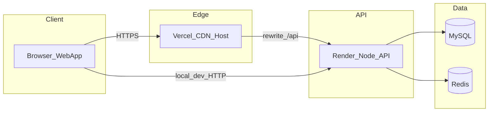

# CareFlow compliance program

This folder tracks CareFlow's path toward **healthcare-grade security** and regulatory alignment with:

- **HIPAA** (US Health Insurance Portability and Accountability Act) — for US covered entities handling PHI
- **DPDP Act 2023** (India Digital Personal Data Protection Act) — for processing personal data of individuals in India

CareFlow is **India-oriented by default** (timezone `Asia/Kolkata`, currency `INR`, demo domain `careflow.in`) but may serve clinics in other regions. Compliance obligations depend on **where patients and clinics are located** and **what data you process**.

> **Status:** Phase 0 (documentation baseline). The product is **not** HIPAA- or DPDP-certified today. See [compliance-checklist.md](./compliance-checklist.md) for item-by-item status.

---

## Documents in this folder

| Document | Purpose |
|----------|---------|
| [compliance-checklist.md](./compliance-checklist.md) | HIPAA + DPDP control mapping with implementation status |
| [data-inventory.md](./data-inventory.md) | PHI/PII fields by database table and API surface |
| [vendor-subprocessors.md](./vendor-subprocessors.md) | Third parties that process data; BAA/DPA tracking |

Related technical docs elsewhere in the repo:

- [multi-tenancy.md](../multi-tenancy.md) — tenant isolation rules
- [permissions.md](../permissions.md) — RBAC model
- [environments.md](../environments.md) — deployment and secrets
- [public-demo.md](../public-demo.md) — read-only demo tenant (synthetic data only)

**Phase 5 (partial):** Public legal pages at `/privacy` and `/terms` (frontend), registration consent stored in `user_consent_records` (migration `0003_user_consent_records.sql`). Legal text requires counsel review before production PHI.

---

## Scope

### In scope

- All **production** and **shared-dev** environments that store real clinic or patient data
- Data processed by the CareFlow API, web app, MySQL database, and Redis
- Staff users, clinic owners, platform super-admins, and **patients** whose records are stored in the system

### Out of scope (until explicitly included)

- **Public demo tenant** (`demo@careflow.in`) — synthetic/sample data for marketing; must not contain real patient PHI
- Local developer machines using seed data only
- Future features not yet implemented (payments, file upload storage, AI, email/SMS notifications)

### Data classification

| Class | Examples in CareFlow | Handling today |
|-------|----------------------|----------------|
| **PHI / sensitive health data** | Allergies, vitals, visit notes, medicines, appointment clinical fields | Stored in MySQL (plaintext); tenant + branch scoped |
| **PII** | Patient/staff name, phone, email, DOB, address | Stored in MySQL (plaintext) |
| **Authentication secrets** | Password hashes (Argon2), refresh token hashes | Hashed at rest |
| **Operational metadata** | Audit logs (action, resource id — no clinical text) | MySQL `audit_logs` |
| **Public** | Landing page, business types list | No PHI |

Full field list: [data-inventory.md](./data-inventory.md).

---

## Data flow

1. **Browser** loads the Next.js frontend (Vercel in shared-dev, or `localhost:3000` locally).
2. **API calls** go to the Node/Express backend (`Render` in cloud, or `localhost:3001` locally).
3. **JWT** (access token) authenticates requests; **httpOnly cookie** holds refresh token.
4. **MySQL** stores tenants, users, patients, appointments, clinical visit data, audit logs.
5. **Redis** is used for health checks (sessions/rate limits not fully wired to Redis yet).

Transmission: HTTPS at the edge in production. Database connection TLS depends on provider configuration — see [environments.md](../environments.md).

---

## Roles and ownership

Fill in before production launch with real PHI:

| Role | Name | Contact | Responsibilities |
|------|------|---------|------------------|
| **Compliance owner** | _TBD_ | _TBD_ | Checklist upkeep, vendor agreements, incident escalation |
| **Security / engineering lead** | _TBD_ | _TBD_ | Technical controls, phases 1–9 implementation |
| **Legal / privacy counsel** | _TBD_ | _TBD_ | Privacy policy, terms, DPDP notices, HIPAA policies |

---

## Implementation phases

Compliance work is delivered in phases. Phase 0 (this folder) is **documentation only**. Code changes begin in Phase 1.

| Phase | Focus | Type |
|-------|--------|------|
| **0** | Program setup, inventory, checklist | Docs (current) |
| **1** | Security foundation (secrets, passwords, logging, API hardening) | Code |
| **2** | TOTP MFA | Code |
| **3** | Full audit trail + viewer | Code |
| **4** | Encryption at rest | Code + infra |
| **5** | DPDP (privacy pages, consent, data subject rights) | Code + legal | **Partial** — `/privacy`, `/terms`, registration consent in `user_consent_records` |
| **6** | HIPAA organizational (BAAs, policies, incident response) | Legal + docs |
| **7** | Auth hardening (password reset, CSRF, token storage) | Code |
| **8** | Backup, disaster recovery | Ops + scripts |
| **9** | Verification and ongoing compliance | Tests + process |

---

## Subprocessors

Third parties that may process CareFlow data are listed in [vendor-subprocessors.md](./vendor-subprocessors.md). Each requires a **BAA** (US HIPAA) and/or **DPA** (India DPDP) before processing real PHI in production.

---

## Incident reporting

Until [incident-response.md](./incident-response.md) exists (Phase 6), use this escalation path:

1. Engineering lead investigates and contains
2. Compliance owner assesses whether PHI was exposed
3. Legal counsel determines notification obligations (US HHS / India DPB / affected individuals)
4. Document in audit log and incident register (to be added in Phase 5)

---

## Review cadence

| Activity | Frequency |
|----------|-----------|
| Update compliance checklist after each phase | Per phase completion |
| Vendor BAA/DPA status review | Quarterly |
| Data inventory review (new tables/fields) | Per major release |
| Access review (staff roles vs minimum necessary) | Quarterly |
| Backup restore test | Quarterly (after Phase 8) |

---

## Disclaimer

Documentation in this folder supports internal compliance work. It does **not** constitute legal advice. Privacy policies, terms of service, BAAs, and breach notifications must be reviewed by qualified legal counsel before publication or use with real patient data.
