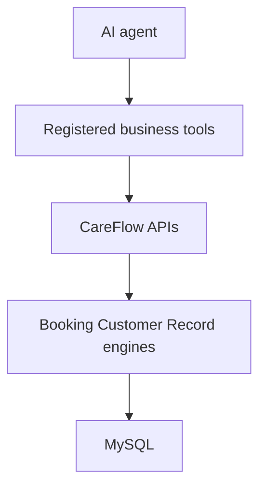

# Future AI integration

AI is an interface, not the source of truth.

When AI is added, it will call the same APIs created here, for example:

- search / get customer (later phase)
- get services / availability (later phase)
- create / reschedule / cancel booking (later phase)
- create notes, records, follow-ups (later phase)

Phase 1 already exposes:

- `POST /api/v1/auth/login`
- customer-adjacent staff APIs are not public booking APIs
- `GET /api/v1/business`
- `GET /api/v1/locations`

The agent must never receive a database connection. It must run with tenant context, permission checks, validation, idempotency, and audit (audit lands in a later phase).
