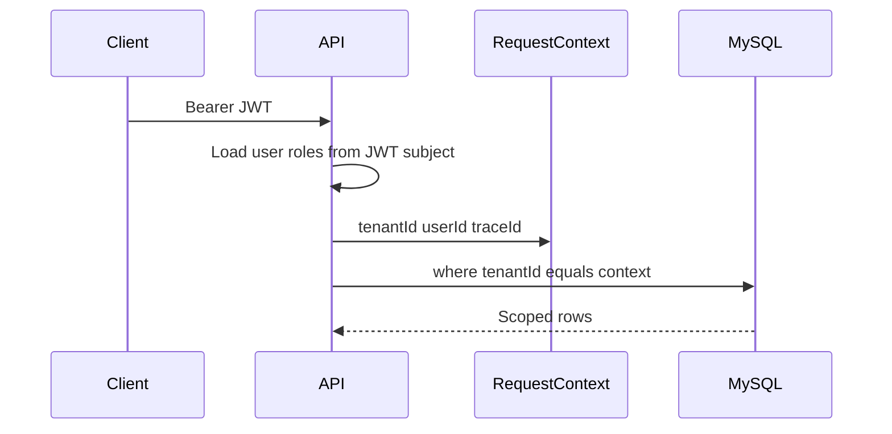

# Multi-tenancy

One installation hosts many businesses. Tenant A must never see Tenant B.

## Rules

- Registration creates a workspace (tenant), an owner user, and one business.
- JWT contains `tenantId`. The API never trusts `tenantId` from the client body.
- Request context (AsyncLocalStorage) carries tenant, user, and trace id.
- Queries for tenant-owned rows always include `tenantId` from context.
- Missing rows in another tenant return `NOT_FOUND` (no leak).
- Platform `SUPER_ADMIN` (`tenantId` null) is the only cross-tenant actor.

